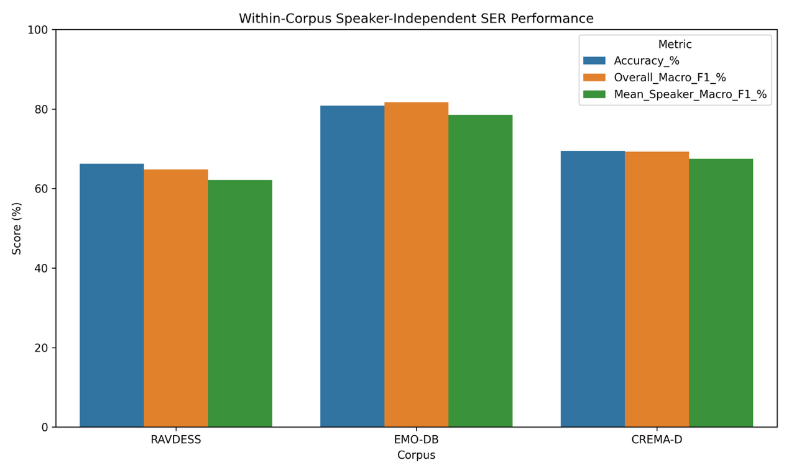
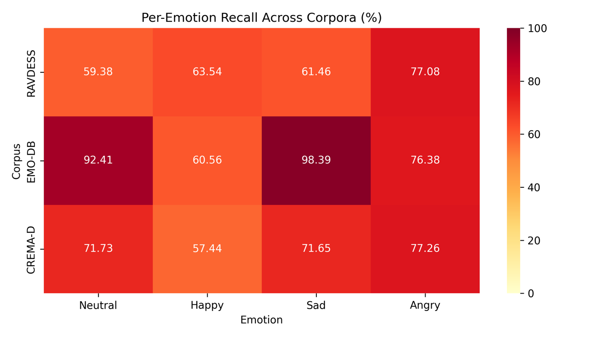
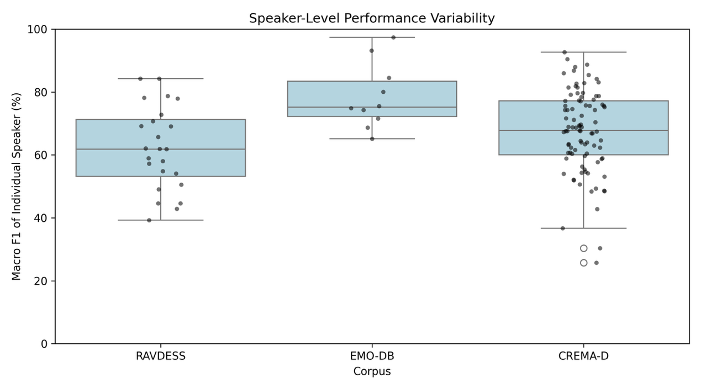

# Speech Emotion Recognition under Emotional-Intensity Mismatch

An independent speech emotion recognition (SER) project investigating how a mismatch between training and testing **emotional expression intensity** affects speaker-independent classification.

The main experiment uses RAVDESS speech recordings and an RBF-kernel support vector machine (SVM). Audio is represented by 31 handcrafted acoustic features: duration, energy statistics, pitch statistics, and 13 MFCC mean/standard-deviation pairs.

## Research questions

1. How much does SER performance change when training and testing intensities match or mismatch?
2. Are the two mismatch directions—Normal-to-Strong and Strong-to-Normal—equally difficult?
3. Which emotions are most affected, and what acoustic changes may explain the errors?
4. Can mixed-intensity training improve robustness?

## Experimental pipeline

`audio recordings → acoustic feature extraction → scaling → RBF-SVM → speaker-independent evaluation`

- **Emotions:** Happy, Sad, and Angry for the intensity experiment; Neutral is added in the three-corpus baseline.
- **Features:** pitch, energy, duration, and MFCC statistics.
- **Preprocessing:** pitch-extraction failures were checked and handled before model fitting; numerical features were standardized with `StandardScaler`.
- **Classifier:** SVM with an RBF kernel.
- **Metrics:** Accuracy, Macro F1, per-emotion Recall, and confusion matrices.
- **Evaluation:** speakers in the test set are kept out of the training set to reduce speaker leakage.

## Main findings

### 1. Intensity mismatch

| Condition | Fusion Macro F1 |
|---|---:|
| Normal → Normal | 77.77% |
| Normal → Strong | 45.51% |
| Strong → Strong | 80.98% |
| Strong → Normal | 39.12% |
| Mixed → Normal | 72.60% |
| Mixed → Strong | 73.87% |

Matched-intensity conditions reached approximately **78–81% Macro F1**, whereas mismatched conditions fell to approximately **39–46%**. The effect was directional: Strong Happy speech was often predicted as Angry, while Normal Angry speech was often predicted as Happy or Sad after training only on Strong expressions. Mixed-intensity training recovered much of the lost performance.

### 2. Acoustic interpretation

Moving from Normal to Strong expression changed pitch, energy, duration, and multiple MFCC statistics. These shifts support an interpretation of intensity mismatch as a feature-distribution problem: the classifier encounters acoustic combinations during testing that were not sufficiently represented during training.

### 3. Three-corpus extension

The same speaker-independent pipeline was evaluated separately on RAVDESS, EMO-DB, and CREMA-D.

| Corpus | Recordings | Speakers | Accuracy | Overall Macro F1 | Mean Speaker Macro F1 |
|---|---:|---:|---:|---:|---:|
| RAVDESS | 672 | 24 | 66.22% | 64.78% | 62.11% |
| EMO-DB | 339 | 10 | 80.83% | 81.69% | 78.51% |
| CREMA-D | 4,898 | 91 | 69.44% | 69.28% | 67.46% |

These are **within-corpus descriptive comparisons**, not evidence that one corpus is inherently better. The corpora differ in language, actors, recording conditions, acting style, and sample size.







## Repository contents

```text
.
├── README.md
├── AI_ASSISTANCE.md
├── requirements.txt
├── data/
│   ├── README.md
│   └── ser_features_sample.csv
├── models/
│   ├── README.md
│   ├── feature_names.json
│   └── ser_fusion_svm_model.joblib
├── notebooks/
│   └── README.md
├── report/
│   └── SER_Project_Report.pdf
├── results/
│   ├── README.md
│   ├── intensity_summary.csv
│   ├── three_corpus_summary.csv
│   └── figures/
└── scripts/
    └── inspect_artifacts.py
```

## Data and privacy

Raw corpus audio is not redistributed in this repository. Volunteer recordings are also excluded to protect participant privacy. The small CSV in `data/` is a path-sanitized sample of extracted RAVDESS features for demonstrating the table format.

Dataset sources and licensing information are listed in [data/README.md](data/README.md).

## Reproducibility status

The repository currently contains the report, numerical summaries, figures, a trained RAVDESS fusion model, its ordered feature list, and a sanitized feature sample. The original Colab notebook should be exported as `.ipynb` and added to `notebooks/` before treating this as a fully reproducible release.

To inspect the included artifacts:

```bash
python -m pip install -r requirements.txt
python scripts/inspect_artifacts.py
```

## Limitations

- RAVDESS contains acted rather than spontaneous emotion.
- The main intensity experiment uses two discrete intensity levels.
- The external volunteer pilot contains only 62 recordings from three speakers and is exploratory.
- Most experiments use one classifier family; future work should compare additional models.
- Cross-corpus differences are confounded by language, recording setup, acting style, and speaker composition.


## AI Assistance Disclosure

The Python implementation was developed with AI assistance. I defined the research focus, organized and ran the experiments, reviewed the outputs, and interpreted the results.

## Author

**Chan Yunchen**  
Independent high-school research project
